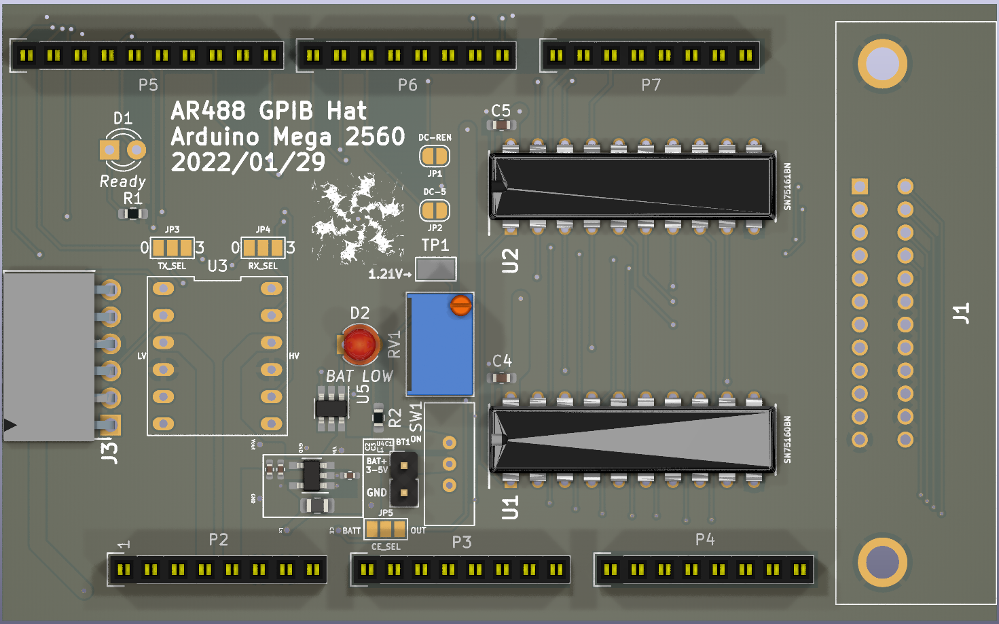
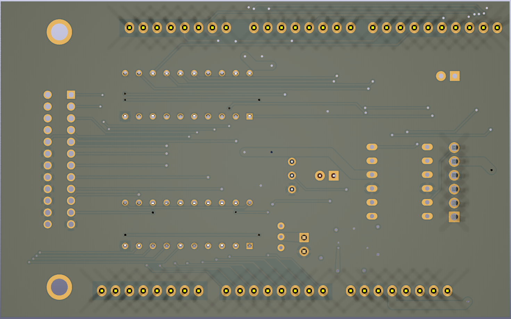

View this project on [CADLAB.io](https://cadlab.io/project/26454). 

# AR488 Bluetooth Mega 2560
 Source code and KiCad PCB design files for AR488 with Arduino Mega 2560

This board is capable to communicate IEEE-488 protocol between the instrument and a PC. The communication can be with a USB cable or battery-power Bluetooth communication.
The firmware is from https://github.com/Twilight-Logic/AR488. Thanks to his help for this hardware project.

## Please do not use the previous two releases as they have wrong connection and will make your board not working.
Firmware is in folder `AR488-firmware`. The Schematic and PCB files are edited with KiCad 6. BOM is `AR488-Bluetooth-BOM.csv` (#todo)Gerber Files are compressed in `AR488-Gerber.zip`.

You can find the chips here: [SN75160BN](https://www.mouser.co.uk/ProductDetail/Texas-Instruments/SN75160BN?qs=Dqy2GfToSoSUifmRVz6Aqg%3D%3D) and [SN75161BN](https://www.mouser.co.uk/ProductDetail/Texas-Instruments/SN75161BN?qs=Dqy2GfToSoS%252BO4WL2FUX5A%3D%3D).

The GPIB connector I use: [112-024-213R001](https://www.mouser.co.uk/ProductDetail/NorComp/112-024-213R001?qs=IGgAdOvCTsR9oVdHJ26vTQ%3D%3D). Please note that this is a *female* connector, so you will need a GPIB male-male cable.

The Level Shifter (U3) was purchased from [here](https://www.amazon.co.uk/gp/product/B082F6BSB5/ref=ppx_yo_dt_b_asin_title_o09_s00?ie=UTF8&psc=1). It is currently out of stock. However, there are a lot of similar devices. I believed you can easily find an alternative.
The Bluetooth Module (J3) was purchased from [here](https://www.amazon.co.uk/gp/product/B0722MD4FY/ref=ppx_yo_dt_b_asin_title_o02_s00?ie=UTF8&psc=1). When connect it to J2, the attenna track should face upwards.

Connect either JP1 or JP2 to configure whether the DC pin of SN75161BN is connected to REN or Arduino D5. Default should connect JP2. If you want to connect DC-REN, please change that in the `AR488_config.h`.

Connect JP2, "0" side of JP3 and JP4 as the origin setup. You can change that accordingly with the `AR488_config.h`.

## UPDATE 202201311924
1. The connection to the GPIB connector is corrected. Please do not use the previous two releases as they have wrong connection and will make your board not working.
2. A battery circuit is added.
	- (!! DO NOT CONNECT BATTERY IF THE DEVICE IS POWER BY USB OR POWER JACK !!)
	- It accepts voltage range from 3V to 5V. Two AAA batteries are ideal. The SPDT switch will turn on the device.
	- A Boost Switching DC-DC IC (XC9141B50CMR-G)(U4) is used to power the arduino and device.
	- A comparator (U5)(MCP65R41T-1202E/CHY) is used to compare the battery voltage to the 1.21V reference voltage. When the battery voltage drops to the threshold voltage, the "BAT LOW" LED will turn on. The output `CE_OUT` will be driven to LOW.
	- The forward voltage of the "BAT LOW" LED should be less than 2.5V. Red, Amber or Yellow LED will work fine.
	- The potentialmeter is to control the voltage input to the comparator. Adjust it according to the battery specification. To adjust properly, connect a power supply to the `BAT+` input and adjust it to the drained battery voltage. Probe the test point TP1. Adjust RV1 until the voltage is 1.21V.
	- JP5 is the chip enable of the DC-DC IC. If it is connected to BATT, the chip will always be enabled. When connected to OUT, the chip will turn on according to the comparator output `CE_OUT`.

PCB images in KiCad 3D Viewer:

